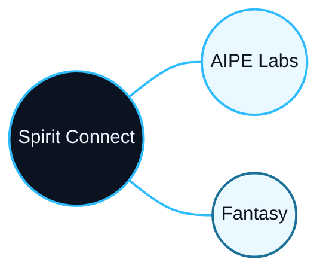

# Hi, I'm Fulong 👋

📍 **Cardiff, UK** | ⚡ **Power Electronics** | 🎓 **Ph.D.** | 🤖 **AI-assisted Design** | 🚀 **Founder @ Spirit Connect Ltd**

> Energy helps humanity enter a Type I civilisation.

## Spirit Connect

* 🌐 **[Spirit Connect](https://spiritconnect.co.uk/)** - Main brand and landing page for my connected research, design, and creative work
  * 🧠 **[AIPE Labs](https://fulongli.github.io/Spirit-Connect-AIPE-Labs/)** - AI-assisted power electronics, power devices, design tools, and engineering agents
  * ✍️ **[Fantasy](https://fulongli.github.io/Spirit-Connect-Fantasy/)** - Fiction, worldbuilding, and long-form creative projects

## Current Projects

### Profile & Sites

* 🌐 **[Spirit Connect](https://spiritconnect.co.uk/)** - Main landing page for Spirit Connect
* 🏠 **[fulongli.github.io](https://fulongli.github.io/)** - Personal academic and professional site
* 🌐 **[spiritconnect.github.io](https://github.com/FulongLi/spiritconnect.github.io)** - Spirit Connect landing page source
* ⚡ **[Spirit-Connect-AIPE-Labs](https://github.com/FulongLi/Spirit-Connect-AIPE-Labs)** - AI-assisted power electronics lab site
* ✍️ **[Spirit-Connect-Fantasy](https://github.com/FulongLi/Spirit-Connect-Fantasy)** - Fiction worldbuilding site
* 🎨 **[AnotherWorldArt](https://github.com/FulongLi/AnotherWorldArt)** - AnotherWorld AI art and concept design

### AI-Assisted Power Electronics

* 📦 **[AIPE-power-device-library](https://github.com/FulongLi/AIPE-power-device-library)** - Local web app and data library for power semiconductor devices
* 🗄️ **[Power-Device-Database](https://github.com/FulongLi/Power-Device-Database)** - Power semiconductor device database
* 🤖 **[Power-Electronics-Design-Agent](https://github.com/FulongLi/Power-Electronics-Design-Agent)** - Agent workflow for power electronics design
* 🧠 **[AI-design-PE](https://github.com/FulongLi/AI-design-PE)** - AI-assisted power electronics design experiments
* 🧩 **[spirit-connect-giants-skills-PE](https://github.com/FulongLi/spirit-connect-giants-skills-PE)** - Codex skills for PE simulation, debugging, and design workflows
* 📄 **[IEEE-Paper-Agent](https://github.com/FulongLi/IEEE-Paper-Agent)** - IEEE paper writing and LaTeX agent workflow

### Research, Grid & Optimisation

* 🚗 **[EVChargingPlanning](https://github.com/FulongLi/EVChargingPlanning)** - Grid-aware EV charging station planning
* 🏘️ **[DC-community](https://github.com/FulongLi/DC-community)** - Residential DC microgrid community experiments
* 📉 **[converter_opt1](https://github.com/FulongLi/converter_opt1)** - Converter optimisation experiments
* 📉 **[BuckConverterOptimisation](https://github.com/FulongLi/BuckConverterOptimisation)** - Multi-objective buck converter optimisation
* 🔋 **[MicrogridEnergyManagementSystermDesign](https://github.com/FulongLi/MicrogridEnergyManagementSystermDesign)** - Microgrid energy management system design

### Power Electronics, Converters & Systems

* 🔌 **[SolidStateTransformer](https://github.com/FulongLi/SolidStateTransformer)** - Solid-state transformer modeling and design
* 📚 **[PowerElectronicsDeviceLibrary](https://github.com/FulongLi/PowerElectronicsDeviceLibrary)** - Extended PE device reference library
* 🔀 **[IsolatedCoverters](https://github.com/FulongLi/IsolatedCoverters)** - Isolated converter topologies
* ➡️ **[NonisolatedCoverters](https://github.com/FulongLi/NonisolatedCoverters)** - Non-isolated converter topologies
* 🧪 **[DCMicrogridTestBench](https://github.com/FulongLi/DCMicrogridTestBench)** - DC microgrid hardware test bench
* 📡 **[WirelessPowerTransferTestBench](https://github.com/FulongLi/WirelessPowerTransferTestBench)** - Wireless power transfer test bench
* 🌡️ **[HeatSinkOptimisation](https://github.com/FulongLi/HeatSinkOptimisation)** - Heat-sink thermal optimisation
* ⚡ **[DoublePulseTestAutomation](https://github.com/FulongLi/DoublePulseTestAutomation)** - Automated double-pulse switching test
* 🌡️ **[ThermalImpedacenMeasurementAutomation](https://github.com/FulongLi/ThermalImpedacenMeasurementAutomation)** - Automated thermal impedance measurement

### Magnetics & Sensing

* 🧲 **[Magnetics-InductorDesign](https://github.com/FulongLi/Magnetics-InductorDesign)** - Inductor design and optimisation
* 🌀 **[PCB-Rogowski-Coil](https://github.com/FulongLi/PCB-Rogowski-Coil)** - PCB Rogowski coil current sensor
* 📏 **[Magnetics-PCBCurrentTransformerTransducer](https://github.com/FulongLi/Magnetics-PCBCurrentTransformerTransducer)** - PCB current-transformer transducer

### Data, Vision & Forks

* 🤖 **[Transistor-MOSFETLibraryANN](https://github.com/FulongLi/Transistor-MOSFETLibraryANN)** - ANN-based MOSFET parameter modeling and selection
* 👁️ **[AIDataVision](https://github.com/FulongLi/AIDataVision)** - Data and vision experiments for engineering workflows
* 👁️ **[PowerVision](https://github.com/FulongLi/PowerVision)** - Vision-based power electronics analysis (fork)
* 🗄️ **[transistordatabase](https://github.com/FulongLi/transistordatabase)** - Unified power transistor management tool (fork of upb-lea)
* 🧪 **[magnetchallenge](https://github.com/FulongLi/magnetchallenge)** - MagNet Challenge 2023 (fork)
* 📐 **[text-to-cad](https://github.com/FulongLi/text-to-cad)** - Open-source text-to-CAD harness (fork)

### Fiction & Creative Work

* 🏛️ **[AncientCivilizations](https://github.com/FulongLi/AncientCivilizations)** - Ancient civilizations worldbuilding
* 🌌 **[AnotherWorld](https://github.com/FulongLi/AnotherWorld)** - Another-world fiction
* 🎨 **[AnotherWorldArt](https://github.com/FulongLi/AnotherWorldArt)** - AI art and concept design for AnotherWorld
* 🧊 **[Spirit-Connect-3D-Projector](https://github.com/FulongLi/Spirit-Connect-3D-Projector)** - 3D projector concept prototype
* 🧰 **[PXT](https://github.com/FulongLi/PXT)** - PanXin Technology / prototype repository

## Useful Tools for PE Engineers

A curated collection of open-source tools I find valuable for power electronics research and design.

### Power Electronics

* 🖊️ **[Inkscape Electric Symbols](https://github.com/upb-lea/Inkscape_electric_Symbols)** - Electrical drawing symbols for Inkscape
* 📋 **[awesome-open-source-power-electronics](https://github.com/upb-lea/awesome-open-source-power-electronics)** - Curated list of open-source PE tools
* 🧲 **[FEM Magnetics Toolbox (FEMMT)](https://github.com/upb-lea/FEM_Magnetics_Toolbox)** - FEM simulation for magnetic components
* 🗄️ **[Material Database](https://github.com/upb-lea/materialdatabase)** - Ferrite core material datasheets and measurements
* 🔌 **[PE Capacitor Selection Toolbox](https://github.com/upb-lea/capacitor_selection_toolbox)** - Foil capacitor selection and comparison
* 🌡️ **[Heat Sink Computation Toolbox](https://github.com/upb-lea/HCT_heat_sink_computation_toolbox)** - Fan-cooled heat-sink sizing and optimisation
* 🧪 **[MagNet Hub](https://github.com/upb-lea/mag-net-hub)** - Certified models from the MagNet Challenge

### CAD, Simulation & Plotting

* 🐍 **[pyGeckoCircuits2](https://github.com/upb-lea/pygeckocircuits2)** - Python wrapper for GeckoCIRCUITS
* 📐 **[KiClearance](https://github.com/upb-lea/KiClearance)** - KiCad clearance rules generator
* 🗂️ **[LEA KiCad Library](https://github.com/upb-lea/LEA_KiCad_Library)** - Reviewed symbols and footprints with Mouser part numbers
* 📊 **[pySignalScope](https://github.com/upb-lea/pySignalScope)** - Simulation and measurement plotting

### Reinforcement Learning, Motor & Grid

* 🎓 **[RL Course Materials](https://github.com/upb-lea/reinforcement_learning_course_materials)** - Lectures, tutorials and solutions for RL
* 🏎️ **[Gym Electric Motor (GEM)](https://github.com/upb-lea/gym-electric-motor)** - OpenAI Gym environment for electric motors
* ⚙️ **[OpenModelica Microgrid Gym](https://github.com/upb-lea/openmodelica-microgrid-gym)** - Microgrid Gym environment
* 🔌 **[ElectricGrid.jl](https://github.com/upb-lea/ElectricGrid.jl)** - Time-domain grid modeling with converter control
* 🎛️ **[gem-control](https://github.com/upb-lea/gem-control)** - Linear / field-oriented controllers for GEM
* 🤖 **[meta_RL_PMSM](https://github.com/upb-lea/meta_RL_PMSM)** - Meta RL for PMSM current control across power classes

## Connect

[GitHub](https://github.com/FulongLi) · [Personal Site](https://fulongli.github.io/) · [Spirit Connect](https://spiritconnect.co.uk/) · [AIPE Labs](https://fulongli.github.io/Spirit-Connect-AIPE-Labs/) · [Fantasy](https://fulongli.github.io/Spirit-Connect-Fantasy/)
