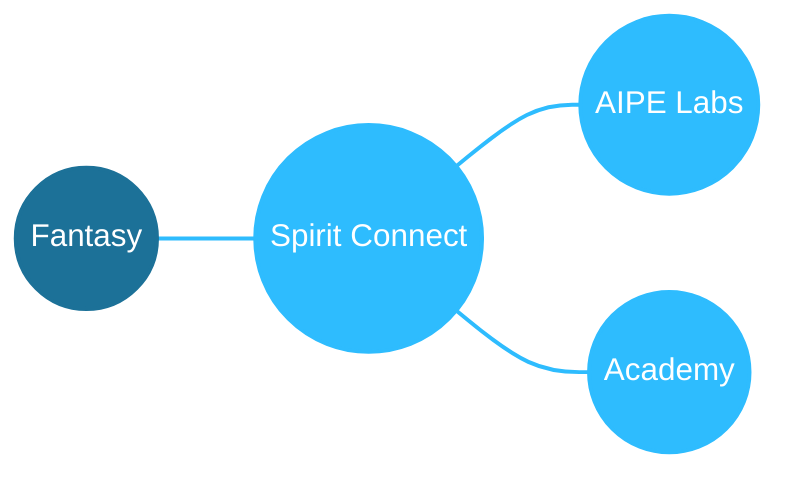

# Hi, I'm Fulong 👋

📍 **Cardiff, UK** | ⚡ **Power Electronics** | 🎓 **Ph.D.** | 🤖 **AI-assisted Design** | 🚀 **Founder @ AIPE Labs**

> Energy helps humanity enter a Type I civilisation.

## Spirit Connect

```mermaid
---
config:
  look: classic
  flowchart:
    minNodeWidth: 0
---
flowchart LR
    FANTASY(("Fantasy"))
    SC(("Spirit Connect"))
    AIPE(("AIPE Labs"))
    ACADEMY(("Academy"))

    FANTASY --- SC
    SC --- AIPE
    SC --- ACADEMY

    linkStyle 0,1,2 stroke:#2EBCFE,stroke-width:2px;

    classDef brand fill:#2EBCFE,stroke:#2EBCFE,stroke-width:2px,color:#ffffff;
    classDef lab fill:#2EBCFE,stroke:#2EBCFE,stroke-width:2px,color:#ffffff;
    classDef story fill:#1C7198,stroke:#1C7198,stroke-width:2px,color:#ffffff;
    classDef academy fill:#2EBCFE,stroke:#2EBCFE,stroke-width:2px,color:#ffffff;

    class SC brand;
    class AIPE lab;
    class FANTASY story;
    class ACADEMY academy;
```

* 🌐 **[Spirit Connect](https://spiritconnect.co.uk/)** - Main brand and landing page for my connected research, design, and creative work
  * 🧠 **[AIPE Labs](https://aipel.co.uk/)** - AI-assisted power electronics, power devices, design tools, and engineering agents
  * ✍️ **[Fantasy](https://fulongli.github.io/Spirit-Connect-Fantasy/)** - Fiction, worldbuilding, and long-form creative projects
  * 🎓 **[Academy](https://github.com/FulongLi/AIPE-Academy)** - Open, AI-guided power engineering learning resources

## AIPE Ecosystem — AI for Power Engineering

**AIPE** is an open-source-first ecosystem connecting engineering data, models, design tools, simulation workflows, research, and education. The long-term goal is to close the AI–power engineering design loop, with interoperable tools and evidence-linked engineering workflows.

**Start here:** [AIPE Labs](https://aipel.co.uk/) · [Machine/agent-readable capability index](https://aipel.co.uk/aipe.md) · [Browse AIPE repositories](https://github.com/FulongLi?tab=repositories&q=AIPE)

### Core Infrastructure

- **[AIPE-Core](https://github.com/FulongLi/AIPE-Core)** — Shared engineering-state schemas, data conventions, and integration contracts.
- **[AIPE-Registry](https://github.com/FulongLi/AIPE-Registry)** — Discoverable index of AIPE repository capabilities, dependencies, and integration maturity.
- **[AIPE-Doc](https://github.com/FulongLi/AIPE-Doc)** — Reserved documentation repository (currently empty).

### Engineering Data & Models

- **[AIPE-Semiconductor-Database](https://github.com/FulongLi/AIPE-Semiconductor-Database)** — Versioned power-semiconductor data, model imports, measurements, and provenance.
- **[AIPE-Magnetics-Database](https://github.com/FulongLi/AIPE-Magnetics-Database)** — Evidence-first schemas and import workflow for magnetic components; data collection is in an early stage.
- **[AIPE-MOSFET-ANN-Modelling](https://github.com/FulongLi/AIPE-MOSFET-ANN-Modelling)** — Neural-network models for MOSFET losses and thermal behaviour.

### AI Design, CAD & Simulation

- **[AIPE-Design-Agent](https://github.com/FulongLi/AIPE-Design-Agent)** — Converter topology guidance, design calculations, and component-selection workflows.
- **[AIPE-Converter-Optimisation-Agent](https://github.com/FulongLi/AIPE-Converter-Optimisation-Agent)** — Multi-objective converter optimisation and neural-network surrogate modelling.
- **[AIPE-Simulation-Skills](https://github.com/FulongLi/AIPE-Simulation-Skills)** — Reusable simulation, control, CAD, PCB, and field-analysis workflows.
- **[AIPE-Sketch](https://github.com/FulongLi/AIPE-Sketch)** — Automatic electrical schematic layout and SVG generation from a circuit graph/netlist.
- **[AIPE-PCB-Agent](https://github.com/FulongLi/AIPE-PCB-Agent)** — KiCad-based automated PCB design and engineering review; prototype work, not hardware-qualified.

### Research & Technical References

- **[AIPE-IEEE-Paper-Agent](https://github.com/FulongLi/AIPE-IEEE-Paper-Agent)** — Structured, evidence-linked workflows for IEEE manuscripts and LaTeX projects.
- **[AIPE-Solid-State-Transformer](https://github.com/FulongLi/AIPE-Solid-State-Transformer)** — Solid-state transformer design and simulation reference materials.
- **[AIPE-Magnetics-Agnet-Inductor-Design-Example](https://github.com/FulongLi/AIPE-Magnetics-Agnet-Inductor-Design-Example)** — Inductor design drawings and reference examples.

### Learning

- **[AIPE-Academy](https://github.com/FulongLi/AIPE-Academy)** — An AI-guided, project-based learning path from foundations to power electronics.

## Other Projects

### Sites & Platforms

- **[Spirit Connect](https://spiritconnect.co.uk/)** — Main brand and project website.
- **[Personal Website](https://fulongli.github.io/)** — Academic and professional profile.
- **[spiritconnect.github.io](https://github.com/FulongLi/spiritconnect.github.io)** — Spirit Connect website source.
- **[Spirit-Connect-Technology](https://github.com/FulongLi/Spirit-Connect-Technology)** — Technology projects and prototypes.

### Aion & Intelligent Presence

- **[Aion-Presence-Plugin](https://github.com/FulongLi/Aion-Presence-Plugin)** — Visual presence and interactive presentation layer for Codex.
- **[SCF-Presence-Realtime](https://github.com/FulongLi/SCF-Presence-Realtime)** — Realtime voice-driven AI presence with visual expression.

### Power Electronics & Energy Systems

- **[AIPS-Microgrid-EMS-Agent](https://github.com/FulongLi/AIPS-Microgrid-EMS-Agent)** — Agent-oriented microgrid energy management.
- **[AIPS-EV-Charging-Planning](https://github.com/FulongLi/AIPS-EV-Charging-Planning)** — Grid-aware EV charging planning.
- **[DC-community](https://github.com/FulongLi/DC-community)** — Residential DC community research.
- **[BuckConverterOptimisation](https://github.com/FulongLi/BuckConverterOptimisation)** — Multi-objective buck converter optimisation.
- **[IsolatedCoverters](https://github.com/FulongLi/IsolatedCoverters)** / **[NonisolatedCoverters](https://github.com/FulongLi/NonisolatedCoverters)** — Converter topology references.
- **[DCMicrogridTestBench](https://github.com/FulongLi/DCMicrogridTestBench)** / **[WirelessPowerTransferTestBench](https://github.com/FulongLi/WirelessPowerTransferTestBench)** — Hardware test benches.
- **[PCB-Rogowski-Coil](https://github.com/FulongLi/PCB-Rogowski-Coil)** / **[Magnetics-PCBCurrentTransformerTransducer](https://github.com/FulongLi/Magnetics-PCBCurrentTransformerTransducer)** — Current-sensing hardware.
- **[HeatSinkOptimisation](https://github.com/FulongLi/HeatSinkOptimisation)** — Heat-sink thermal optimisation.
- **[PowerElectronicsDeviceLibrary](https://github.com/FulongLi/PowerElectronicsDeviceLibrary)** — Power semiconductor reference library.

### Creative Projects & Experiments

- **[Spirit-Connect-Fantasy](https://github.com/FulongLi/Spirit-Connect-Fantasy)** — Interactive fiction and worldbuilding website.
- **[SCF-Ancient-Civilisations](https://github.com/FulongLi/SCF-Ancient-Civilisations)** / **[SCF-Another-World](https://github.com/FulongLi/SCF-Another-World)** / **[SCF-Another-World-Art](https://github.com/FulongLi/SCF-Another-World-Art)** — Fiction, worldbuilding, and concept art.
- **[Temporal-Slices](https://github.com/FulongLi/Temporal-Slices)** — Experimental time-slice visualisation.
- **[Earthquake-Predictions](https://github.com/FulongLi/Earthquake-Predictions)** — Earthquake prediction experiments.

### Community Resources & Forks

- **[awesome-open-source-power-electronics](https://github.com/FulongLi/awesome-open-source-power-electronics)** — Curated open-source power electronics resources.
- **[PowerVision](https://github.com/FulongLi/PowerVision)** / **[transistordatabase](https://github.com/FulongLi/transistordatabase)** / **[magnetchallenge](https://github.com/FulongLi/magnetchallenge)** — Forked research and tooling resources.

## Useful Tools for PE Engineers

A curated collection of open-source tools for power electronics research and design.

View engineering tools and references

### Power Electronics

* 🖊️ **[Inkscape Electric Symbols](https://github.com/upb-lea/Inkscape_electric_Symbols)** - Electrical drawing symbols for Inkscape
* 📋 **[awesome-open-source-power-electronics](https://github.com/upb-lea/awesome-open-source-power-electronics)** - Curated list of open-source PE tools
* 🧲 **[FEM Magnetics Toolbox (FEMMT)](https://github.com/upb-lea/FEM_Magnetics_Toolbox)** - FEM simulation for magnetic components
* 🗄️ **[Material Database](https://github.com/upb-lea/materialdatabase)** - Ferrite core material datasheets and measurements
* 🔌 **[PE Capacitor Selection Toolbox](https://github.com/upb-lea/capacitor_selection_toolbox)** - Foil capacitor selection and comparison
* 🌡️ **[Heat Sink Computation Toolbox](https://github.com/upb-lea/HCT_heat_sink_computation_toolbox)** - Fan-cooled heat-sink sizing and optimisation
* 🧪 **[MagNet Hub](https://github.com/upb-lea/mag-net-hub)** - Certified models from the MagNet Challenge

### CAD, Simulation & Plotting

* 🐍 **[pyGeckoCircuits2](https://github.com/upb-lea/pygeckocircuits2)** - Python wrapper for GeckoCIRCUITS
* 📐 **[KiClearance](https://github.com/upb-lea/KiClearance)** - KiCad clearance rules generator
* 🗂️ **[LEA KiCad Library](https://github.com/upb-lea/LEA_KiCad_Library)** - Reviewed symbols and footprints with Mouser part numbers
* 📊 **[pySignalScope](https://github.com/upb-lea/pySignalScope)** - Simulation and measurement plotting

### Reinforcement Learning, Motor & Grid

* 🎓 **[RL Course Materials](https://github.com/upb-lea/reinforcement_learning_course_materials)** - Lectures, tutorials and solutions for RL
* 🏎️ **[Gym Electric Motor (GEM)](https://github.com/upb-lea/gym-electric-motor)** - OpenAI Gym environment for electric motors
* ⚙️ **[OpenModelica Microgrid Gym](https://github.com/upb-lea/openmodelica-microgrid-gym)** - Microgrid Gym environment
* 🔌 **[ElectricGrid.jl](https://github.com/upb-lea/ElectricGrid.jl)** - Time-domain grid modeling with converter control
* 🎛️ **[gem-control](https://github.com/upb-lea/gem-control)** - Linear / field-oriented controllers for GEM
* 🤖 **[meta_RL_PMSM](https://github.com/upb-lea/meta_RL_PMSM)** - Meta RL for PMSM current control across power classes

## Connect

[GitHub](https://github.com/FulongLi) · [Personal Site](https://fulongli.github.io/) · [Spirit Connect](https://spiritconnect.co.uk/) · [AIPE Labs](https://aipel.co.uk/) · [Aion Presence](https://github.com/FulongLi/Aion-Presence-Plugin) · [Fantasy](https://fulongli.github.io/Spirit-Connect-Fantasy/) · [Academy](https://github.com/FulongLi/AIPE-Academy)
